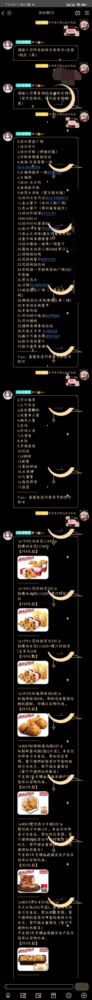

  

## nonebot_plugin_kfcrazy

nonebot2肯德基查询插件，输入地区即可查询全国店铺的数据，支持疯狂星期四!

# 开始使用

克隆本项目到本地，在bot.py中导入插件：

`nonebot.load_plugin(r"包路径\nonebot_plugin_kfcrazy")`

## 使用命令来触发

在有bot的群内发送`/kfc`开始查询肯德基的物品详情，流程：

1.输入`/kfc`以开始一个肯德基查询

2.输入[城市名]或[城市名] [地区（县）名]，注意用空格分开

3.输入店铺关键词匹配店铺，可发送空格来获取当前地区部分结果

4.输入店铺前对应序号查询店铺内所有在售食品主题分类

5.输入主题分类对应序号，可查询食品详情信息

6.结束（finish）

在任意一个阶段中发送“退出”来中断一个查询流程。

## TODO？

* [ ]  增加疯狂星期四查询命令
* [ ]  增加qq号绑定店铺一键查询
* [ ]  疯四文案与图片合成
* [ ]  （待定）

# 效果展示

## **联系我**

  

## 更新日志

2022.10.20 v2.0.2

修复序号正则匹配问题，增加风控异常抛出

2022.10.6 v2.0.1

增加更精准的序号匹配规则，修复部分阶段退出命令无效的问题

2022.10.6 v2.0

重新编写查询逻辑与算法，使返回结果更全面，优化了查询速度，性能提升

2022.9.29 v1.0

最初版本，增加基本查询功能
